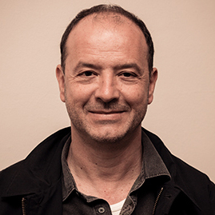

## Event Details
**Date:** 15th of September 2021

**Time:** 7PM (local time)

**Location:** Online (register to get the link)

**Guest Speakers:** Tyna Eloundou, Pelonomi Moiloa, Arnu Pretorius, Tommie Meyer

## Effective Altruism

Effective Altruism (EA) is about doing good better. EA is a philosophy and social movement focused on answering one question: How can we best help others? Our resources are limited, so we have to use them wisely. Effective altruism is the project of:
 1) Using evidence and reason to find the most promising causes to work on.
 2) Taking action, by using our time and money to do the most good we can.

Insert section on the normal stuff that EA works on, e.g. donating to effective charities, effective careers...

Another position held by many individuals in the EA community is that we should not only care about people alive today but also about all the indeviduals that will exist in the future. This philosophy is known as *longtermism* and says that we should carefully think about which threats pose the greatest risks to the future of humanity because these threats have the potential to cause immeasurable suffering for indeviduals in the future. Threats which have the potential to destroy humanity are known as *existential risks* and in the EA community we believe it is important for us to think about which of these risks are most likely, how devastating might they be and how can we mitigate the threat. Some of the highest ranking existential risks are:
 - Climate change
 - Pandemics
 - Nuclear war

What might be supprising to some people is that the EA community generally also sees powerful Artificial General Inteligence (AGI) as another significant existential risk.

## AI Safety & Alignment
AI safety & alignemnt is...

## Guest Speakers
### Tyna Eloundou

### Pelonomi Moiloa

### Tommie Meyer

### Arnu Pretorius

## Discussion Agenda
Firstly, we would like to discuss AI alignment more broadly. Why is AI alignment something we should be concerned about? How can we try to ensure that AGI is aligned with human values? How do we mitigate the existential risk posed by AGI? Professor Tommie Meyer suggested Stuart J. Russell's recent book "Human Compatible" as a framework to structure the discussion. We would like to see where panellists agree and disagree on his takes.

 
Then we would like to take the second part of the discussion into a more focused direction: suppose we successfully manage the alignment problem and AGI does not pose any immediate existential risk to humanity, AI will none the less be a highly disruptive force to the world and global economy. Many say AI will be the next great industrial revolution. If that is the case, how can we ensure that this technology does not only benefit the developed world but has positive effects in Africa as well? Or will powerful AI in the hands of the developed world simply lead to greater exploitation of Africa and the developing world?

## Contact
For more information on the event please send an email to leo{dot}karamanof{at}gmail{dot}com.
