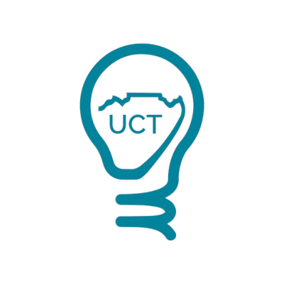

## Event Details
**Date:** 15th of September 2021

**Time:** 7PM (local time)

**Platform:** Zoom (register to get the link)

**Guest Speakers:** Tyna Eloundou, Pelonomi Moiloa, Arnu Pretorius, Tommie Meyer

**Moderated by:** Leo Karamanof, Claude Formanek

## Effective Altruism

Effective Altruism (EA) is a philosophy and global movement focused on doing good better: using evidence and reason to find the most promising causes to work on. Effective Altruism has identified the development of safe, properly-aligned artificial intelligence (AI) as a key cause area to secure the longterm future of humanity.

[Effective Altruism Website](https://www.effectivealtruism.org/)

### Effective Altruism UCT
The University of Cape Town (UCT) has a local chapter of this movement that hosts talks and discussions on areas of interest. To find out about future events follow us [here](https://www.instagram.com/ea_uct/?hl=en).

## AI Safety & Alignment
AI safety & alignemnt is about ensuring that intelligent systems we develop are well-aligned with human values. Whilst it might seem trivial at first, developing super-intelligent machines that are connected to all of human knowledge and can interface with people is a highly technical challenge that requires serious thought. 

AGI could create huge amounts o value for the world. Like the industrial revolution if done right. But if we dont successfully manage the risks then the future of humanity.

## Guest Speakers
### Tyna Eloundou
> OpenAI research scholar.

### Pelonomi Moiloa
> Data scientist and AI ethics advocate.

### Tommie Meyer
> Co-director of the Center for Artificial Intelligence Research.

### Arnu Pretorius
> AI research scientist at InstaDeep.

## Discussion Agenda
The discussion will be structured into two sections and will be followed by 30 minutes of audience Q&A with the panellists.

Why is AI alignment something we should be concerned about? How are people trying to ensure that AI will be aligned with human values? What is the most effective way to mitigate the existential risk posed by AI?

Subsequently, the discussion will turn to relationship between AI development and the African continent. Suppose we successfully manage the alignment problem and AI does not pose any immediate existential risk to humanity, it will still be a highly disruptive force to the world and global economy. Many say AI will be the next great industrial revolution. If that is the case, how can we ensure that this technology does not only benefit the developed world but has positive effects in Africa as well? Or will powerful AI in the hands of the developed world simply lead to greater exploitation of Africa?

## Contact
For more information on the event please send an email to leo{dot}karamanof{at}gmail{dot}com.
