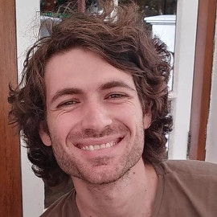

## Event Details
**Date:** 15th of September 2021

**Time:** 7PM (local time)

**Platform:** Zoom (register to get the link)

**Guest Speakers:** Tyna Eloundou, Pelonomi Moiloa, Arnu Pretorius, Tommie Meyer

**Moderated by:** Leo Karamanof, Claude Formanek

## Effective Altruism

Effective Altruism (EA) is a philosophy and global movement that focuses on how we can do good better: using evidence and reason to find the most promising causes to work on and how we can effectively tackle them. Effective Altruism has identified the development of safe, properly-aligned artificial intelligence (AI) as a key cause area to secure the longterm future of humanity. 

Visit the [EA website](https://www.effectivealtruism.org/) for more information.

### Effective Altruism UCT
The University of Cape Town (UCT) has a local chapter of this movement that hosts talks and discussions on areas of interest. To find out about future events follow us [here](https://www.instagram.com/ea_uct/?hl=en).

## AI Safety & Alignment
AI safety & alignment is about ensuring that intelligent systems we develop act in accordance with human values and do not cause harm to us. Whilst it might seem trivial at first - "just programm them not to kill us" - developing super-intelligent machines that are connected to all of human knowledge and can interface with human beings is a highly technical challenge that requires serious consideration. 

If managed correctly, the arrival of AI could create vast amounts of wealth for humanity. On the flip side, if this technological development is approached callously, the consequences may threaten the future of humanity.

## Guest Speakers
### Tyna Eloundou
> OpenAI research scholar.

### Pelonomi Moiloa
> Data scientist and AI ethics advocate.

### Tommie Meyer
> Co-director of the Center for Artificial Intelligence Research.

### Arnu Pretorius
> Lead AI research scientist at InstaDeep.

## Discussion Agenda
The discussion will be structured into two sections and will be followed by 30 minutes of audience Q&A with the panellists.

The first part of the discussion will tacke the issue of AI safety broadly. Why is AI alignment something we should be concerned about? How are people trying to ensure that AI will be aligned with human values? What is the most effective way to mitigate the potential existential risk posed by AI?

Subsequently, the discussion will turn to the relationship between AI development and the African continent. Suppose we successfully manage the alignment problem and AI does not pose an immediate existential risk to humanity, it will nonetheless be a highly disruptive force to the world and global economy. Many say AI will be the next great industrial revolution. If that is the case, how can we ensure that this technology does not only benefit the developed world but has positive effects in Africa as well? Or will powerful AI in the hands of the developed world simply lead to greater exploitation of Africa?

## Reading Recomendations
We will use Stuart Russell's 2019 book [*Human Compatible*](https://www.goodreads.com/en/book/show/44767248-human-compatible) as a framework for the first part of the discussion. If you have not read the book before, we recommend reading a summary of the book on the EA website [here](https://forum.effectivealtruism.org/posts/tsHfFdAGehzoH6BZR/summary-of-stuart-russell-s-new-book-human-compatible). 

Another useful resource is the talk given by Pelonomi Moiloa at the Deep Learning IndabaX in 2019. The talk was titled  *Protecting Machines From Us - Ethics And Bias* and can be found [here](https://www.youtube.com/watch?v=J4ZNp92kEUM).

## Contact
Please register using the Google form at the top of this webpage. You will only be sent information and reminders about this event.

For more information on the event please send an email to leo{dot}karamanof{at}gmail{dot}com.
